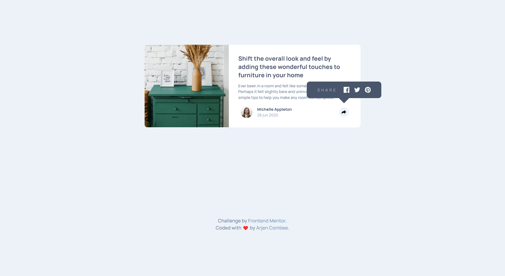

# Frontend Mentor - Article preview component solution

This is a solution to the [Article preview component challenge on Frontend Mentor](https://www.frontendmentor.io/challenges/article-preview-component-dYBN_pYFT). Frontend Mentor challenges help you improve your coding skills by building realistic projects.

## Table of contents

- [Overview](#overview)
  - [The challenge](#the-challenge)
  - [Screenshot](#screenshot)
  - [Links](#links)
- [My process](#my-process)
  - [Built with](#built-with)
  - [What I learned](#what-i-learned)
  - [Continued development](#continued-development)
  - [Useful resources](#useful-resources)
- [Author](#author)
- [Acknowledgments](#acknowledgments)

## Overview

### The challenge

Users should be able to:

- View the optimal layout for the component depending on their device's screen size
- See the social media share links when they click the share icon

### Screenshot



This is my solution for this chachallenge.

### Links

- Solution URL: [GitHub - Repository](https://github.com/ArCombee/FEM-PROJECTS-2023/tree/master/F23-05-ARTICLE-PREVIEW)
- GitHub page: [GitHub - Pages](https://arcombee.github.io/fem/05_article_preview)
- Live Site URL: [My personal site](https://arjencombee.nl/fem/05_article_preview/)

## My process

### Built with

- Semantic HTML5 markup
- CSS custom properties
- Flexbox
- CSS Grid
- Mobile-first workflow

### What I learned

In this project I started the use of SASS and the CUBE CSS methodology. Which was really challenging and it's OK, but not great yet.

```css
.flow > :where(:not(:first-child)) {
  margin-top: var(--flow-content, 1em);
}
```

This CSS part defines the flow between heading and paragraph with an custompropery and fallback.

### Useful resources

- [CUBE CSS](https://cube.fyi/) - This is a way to organise an code the CSS part of a website. For this challenges it is overkill, but it is fun to learn new approaches.

## Author

- Website - [Arjen Combee](https://www.arjencombee.nl)
- Frontend Mentor - [@ArCombee](https://www.frontendmentor.io/profile/ArCombee)

## Acknowledgments

Big shout-out to some people who really inspired me to lean web development. They are the reason why I joined frontendmentor to get better in coding and have a fun time doing so.

♥ Brad Traversy
♥ Jonas Schmedtmann
♥ Kevin Powell
♥ Jessica Chan
